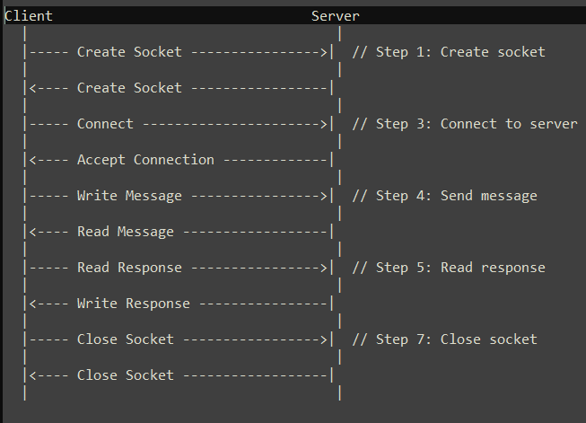
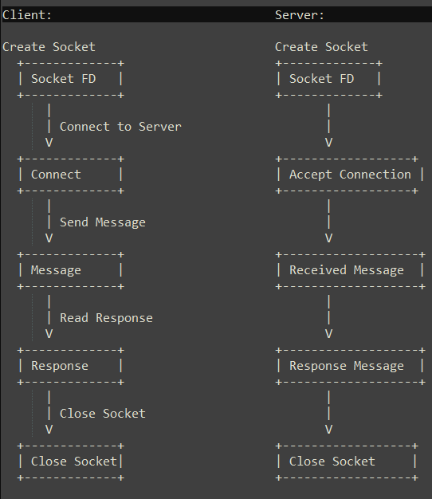

## Simple Server-Client Model

1. Client Side

- Create a socket fd, specify the address details.
- Connect to the server.
- Prepare a message to the server to send (write bufferr).
- Read the server response (read buffer) and print.
- close socket connection.

2. Server Side

- Create a socket for server and set socket options (allow reuse of address)
- Bind the socket to an IP address and port and Bind the address to the socket.
- Starting listening for incoming connections.

### Images/Model

