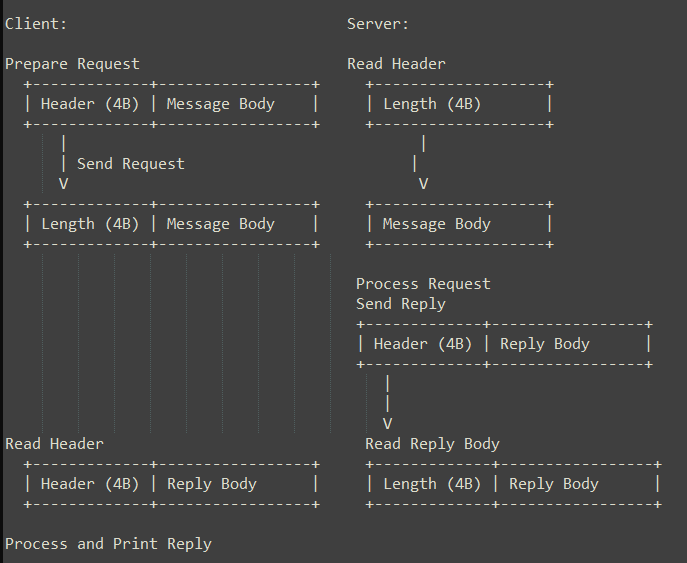

## Overall Interaction

1. Client Side:

- Prepare a request with length and body.
- Send the request to the server.
- Read the reply header and body.
- Process and print the reply.

2. Server Side:

- Read the request header and body.
- Process the request.
- Prepare and send a reply with length and body.
- Continue to the next request or close the connection.

